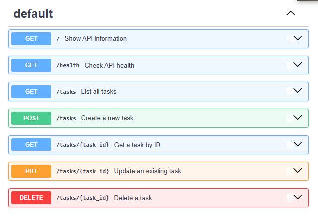

# Task CRUD API

A simple REST API built with Python and FastAPI for managing tasks.

The API supports full CRUD operations using an in-memory list. No database or files are used for storing task data.

## Features

- Create a new task
- List all tasks
- Get a single task by ID
- Update an existing task
- Delete a task
- Input validation
- Correct HTTP status codes
- Interactive Swagger UI documentation

## Installation

Create and activate a virtual environment, then install the required packages:

```powershell
python -m venv venv
.\venv\Scripts\Activate.ps1
pip install fastapi uvicorn
```

## Run the API

Start the server with:

```powershell
uvicorn main:app --reload
```

The API will run at:

`http://127.0.0.1:8000`

Swagger UI is available at:

`http://127.0.0.1:8000/docs`

## API Endpoints

| Method | Endpoint | Description | Success Status |
|---|---|---|---|
| GET | `/tasks` | List all tasks | 200 |
| GET | `/tasks/{task_id}` | Get a task by ID | 200 |
| POST | `/tasks` | Create a new task | 201 |
| PUT | `/tasks/{task_id}` | Update an existing task | 200 |
| DELETE | `/tasks/{task_id}` | Delete a task | 204 |

Invalid request bodies return `400 Bad Request`.

Requests for task IDs that do not exist return `404 Not Found`.

## Example curl Response

Command:

```powershell
curl.exe -i http://127.0.0.1:8000/tasks/1
```

Example output:

```text
HTTP/1.1 200 OK
server: uvicorn
content-type: application/json

{"id":1,"title":"Learn Python","done":false}
```

## Swagger UI

FastAPI automatically generates interactive API documentation using Swagger UI.

The full CRUD cycle can be tested from the browser using the **Try it out** button.



## Data Storage

This project uses an in-memory Python list for storing tasks.

Because there is no database, tasks created or modified while the server is running are lost when the application restarts.